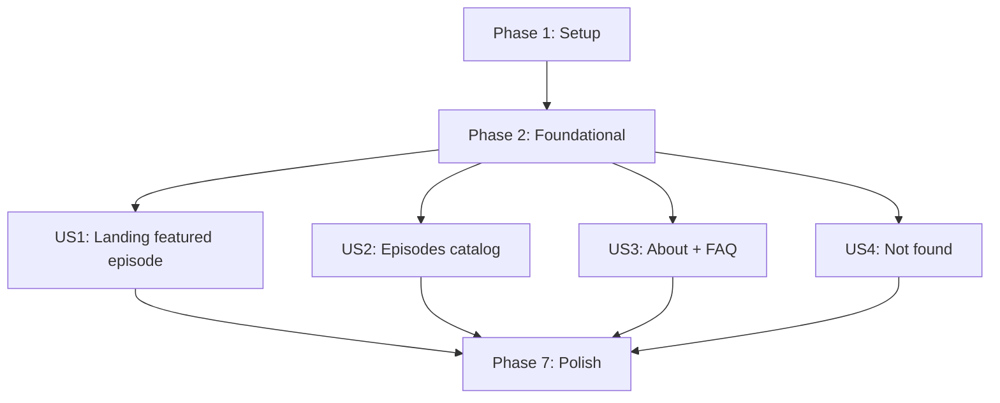

# Tasks: Podcast Website MVP

**Input**: Design documents from `/specs/001-podcast-site-mvp/`

- plan.md
- spec.md
- research.md
- data-model.md
- contracts/openapi.yml
- quickstart.md

**Tests**: Not explicitly requested in the spec. Tasks focus on implementing the feature plus the required build/lint quality gate (`npm test`).

**Organization**: Tasks are grouped by user story so each story can be implemented and validated independently after the Foundational phase.

## Phase 1: Setup (Shared Infrastructure)

**Purpose**: Initialize the Next.js project with static export constraints.

- [x] T001 Create Next.js app scaffold in web/ (create-next-app) producing web/package.json and web/app/layout.tsx
- [x] T002 Configure static export in web/next.config.ts (set `output: 'export'` and ensure static-host compatibility)
- [x] T003 [P] Configure scripts in web/package.json so `npm test` runs lint + production build
- [x] T004 [P] Add global CSS variables + baseline responsive styles in web/app/globals.css
- [x] T005 [P] Implement base App Router layout shell in web/app/layout.tsx (header slot + main content container)
- [x] T006 [P] Add site metadata defaults (title/description) in web/app/layout.tsx using build-time values

---

## Phase 2: Foundational (Blocking Prerequisites)

**Purpose**: Shared building blocks that all user stories rely on.

**Checkpoint**: After this phase, each user story can be implemented without changing shared foundations.

- [x] T007 [P] Define content types in web/content/types.ts (Episode, ShowInfo, FAQItem)
- [x] T008 [P] Create ShowInfo content module in web/content/show.ts (stable show title/tagline/description)
- [x] T009 [P] Create FAQ content module in web/content/faqs.ts with >= 5 items
- [x] T010 [P] Create Episodes content module in web/content/episodes.ts with exactly 20 episodes and deterministic ordering rules
- [x] T011 [P] Implement featured selection helper in web/content/episodes.ts (`getFeaturedEpisode()` returns most recent publishDate)
- [x] T012 [P] Add mocked audio asset at web/public/audio/teaser.mp3 and reference it as Episode.audioSrc for all episodes
- [x] T013 [P] Implement navigation header component in web/components/SiteHeader.tsx with styles in web/components/SiteHeader.module.css
- [x] T014 [P] Implement episode card component in web/components/EpisodeCard.tsx with styles in web/components/EpisodeCard.module.css
- [x] T015 [P] Implement audio player component in web/components/AudioPlayer.tsx with styles in web/components/AudioPlayer.module.css (button starts play; obvious pause/resume)
- [x] T016 Wire SiteHeader into web/app/layout.tsx so nav exists on all pages (links to /, /episodes, /about, /faq)
- [x] T017 Ensure mobile-first layout constraints are enforced in web/app/globals.css (typography scale + spacing that works on small screens)

---

## Phase 3: User Story 1 - Discover the featured episode (Priority: P1) 

**Goal**: Deliver a sleek landing page with exactly one featured episode and a primary Listen CTA.

**Independent Test**: Navigate to `/` and verify exactly one featured episode is shown and the Listen CTA starts mocked audio playback with pause/resume.

- [x] T018 [US1] Implement landing page in web/app/page.tsx using ShowInfo from web/content/show.ts
- [x] T019 [US1] Display exactly one featured episode (title + summary) in web/app/page.tsx using getFeaturedEpisode() from web/content/episodes.ts
- [x] T020 [US1] Implement primary Listen CTA in web/app/page.tsx that starts playback via web/components/AudioPlayer.tsx
- [x] T021 [US1] Add a one-click link to `/episodes` from the landing page in web/app/page.tsx (meets SC-001)

**Checkpoint**: Landing page is MVP-complete and demoable.

---

## Phase 4: User Story 2 - Browse all episodes (Priority: P2)

**Goal**: Provide an Episodes page listing all 20 mocked episodes with listen actions.

**Independent Test**: Navigate to `/episodes` and verify 20 episodes render in deterministic order; clicking Listen starts mocked audio with pause/resume.

- [x] T022 [US2] Implement Episodes page in web/app/episodes/page.tsx rendering the 20 episodes from web/content/episodes.ts
- [x] T023 [US2] Enforce deterministic ordering in web/app/episodes/page.tsx (publishDate desc, tie-break by id)
- [x] T024 [US2] Add per-episode Listen action in web/app/episodes/page.tsx using web/components/AudioPlayer.tsx
- [x] T025 [US2] Remove any randomness from episode generation so reload shows identical data/order (web/content/episodes.ts)

**Checkpoint**: Episodes catalog is stable and usable.

---

## Phase 5: User Story 3 - Learn about the show and get answers (Priority: P3)

**Goal**: Provide About and FAQ pages accessible from the global navigation.

**Independent Test**: From any page, use the header nav to open `/about` and `/faq`; verify About content is present and FAQ shows >= 5 Q/A items.

- [x] T026 [P] [US3] Implement About page in web/app/about/page.tsx using ShowInfo from web/content/show.ts
- [x] T027 [P] [US3] Implement FAQ page in web/app/faq/page.tsx rendering items from web/content/faqs.ts
- [x] T028 [US3] Verify SiteHeader links work site-wide (layout wiring in web/app/layout.tsx)

**Checkpoint**: Trust-building pages complete.

---

## Phase 6: User Story 4 - Handle unknown links gracefully (Priority: P4)

**Goal**: Provide a helpful not-found experience with a recovery path.

**Independent Test**: Navigate to a non-existent route and confirm a “not found” message is shown with a link back to `/`.

- [x] T029 [US4] Implement not-found page in web/app/not-found.tsx with clear message + link back to `/`
- [x] T030 [US4] Validate not-found behavior works in static export output (adjust web/next.config.ts if required)

**Checkpoint**: Broken links are no longer dead ends.

---

## Phase 7: Polish & Cross-Cutting Concerns

**Purpose**: Accessibility, performance, and documentation improvements that apply across pages.

- [x] T031 [P] Add skip-link + visible focus styles in web/app/layout.tsx and web/app/globals.css
- [x] T032 [P] Ensure AudioPlayer is keyboard operable with appropriate labels in web/components/AudioPlayer.tsx
- [x] T033 [P] Ensure any images used include alt text and don't regress performance (web/public/images/ + component usage)
- [x] T034 Apply consistent "sleek" spacing/typography polish across pages in web/app/globals.css and component CSS modules
- [x] T035 Create web/README.md with dev/build/preview instructions consistent with specs/001-podcast-site-mvp/quickstart.md
- [x] T036 Run quickstart validation commands (`cd web && npm install && npm test && npm run build`) and fix any failures in web/package.json, web/next.config.ts, or page/components

---

## Dependencies & Execution Order

### Dependency Graph

### User Story Completion Order (Default)

- P1: US1 (MVP)
- P2: US2
- P3: US3
- P4: US4

---

## Parallel Execution Examples

### Phase 1 (after T001/T002)

- T003, T004, T005, T006 can be done in parallel (different files).

### Phase 2

- T007–T012 can be done in parallel (content + assets).
- T013–T015 can be done in parallel (separate components).

### User Story 1

- US1 is mostly single-file work in web/app/page.tsx; parallelism mainly comes from ensuring foundational components/content are complete.

### User Story 2

- Pair programming option: one person builds web/app/episodes/page.tsx while another hardens web/components/EpisodeCard.tsx.

### User Story 3

- T026 (About) and T027 (FAQ) are explicitly parallelizable.

---

## Implementation Strategy

### MVP First

1. Complete Phase 1 + Phase 2
2. Complete US1
3. Run T036 to validate build + export

### Incremental Delivery

- Add US2, then US3, then US4, validating `npm test` + export after each story.
